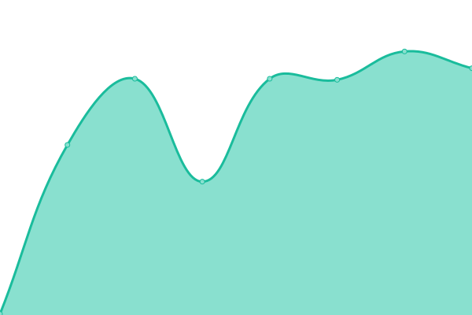

# [📈 Live Status](https://dmatarinl.github.io/MoniBot): <!--live status--> **🟩 All systems operational**

This repository contains the open-source uptime monitor and status page for [David Matarin](https://www.linkedin.com/in/david-m-l/), powered by [Upptime](https://github.com/upptime/upptime).

With [Upptime](https://upptime.js.org), you can get your own unlimited and free uptime monitor and status page, powered entirely by a GitHub repository. We use [Issues](https://github.com/dmatarinl/MoniBot/issues) as incident reports, [Actions](https://github.com/dmatarinl/MoniBot/actions) as uptime monitors, and [Pages](https://dmatarinl.github.io/MoniBot) for the status page.

<!--start: status pages-->
<!-- This summary is generated by Upptime (https://github.com/upptime/upptime) -->
<!-- Do not edit this manually, your changes will be overwritten -->
<!-- prettier-ignore -->
| URL | Status | History | Response Time | Uptime |
| --- | ------ | ------- | ------------- | ------ |
|  [ButlerScientifics](https://www.butlerscientifics.com/) | 🟩 Up | [butler-scientifics.yml](https://github.com/dmatarinl/MoniBot/commits/HEAD/history/butler-scientifics.yml) | 

 734ms
     
 | 

<a href="https://dmatarinl.github.io/MoniBot/history/butler-scientifics">99.59%</a>
    

|  [MyAD](https://autodiscovery.butlerscientifics.com/#/) | 🟩 Up | [my-ad.yml](https://github.com/dmatarinl/MoniBot/commits/HEAD/history/my-ad.yml) | 

 2447ms
     
 | 

<a href="https://dmatarinl.github.io/MoniBot/history/my-ad">99.53%</a>
    

|  [TheGoldAntidote](https://www.thegoldantidote.com/) | 🟩 Up | [the-gold-antidote.yml](https://github.com/dmatarinl/MoniBot/commits/HEAD/history/the-gold-antidote.yml) | 

 2673ms
     
 | 

<a href="https://dmatarinl.github.io/MoniBot/history/the-gold-antidote">100.00%</a>
    

<!--end: status pages-->

[**Visit our status website →**](https://dmatarinl.github.io/MoniBot)

## 📄 License

- Powered by: [Upptime](https://github.com/upptime/upptime)
- Code: [MIT](./LICENSE) © [Anand Chowdhary](https://anandchowdhary.com), supported by [Pabio](https://pabio.com)
- Data in the `./history` directory: [Open Database License](https://opendatacommons.org/licenses/odbl/1-0/)
